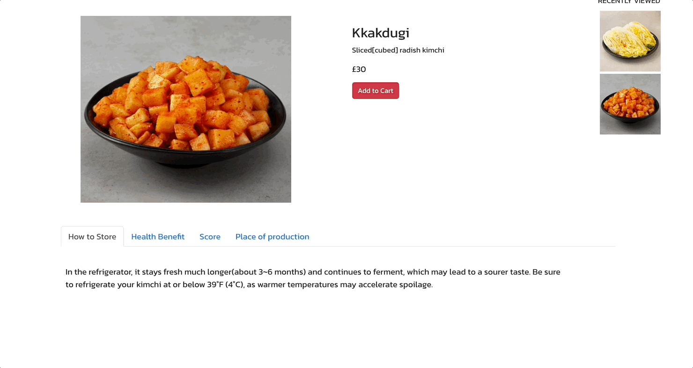

# Kimchi Shopping mall

## Overview

This app was created to sell Korea's Korgeous Kimchi 🥬🌶️

#### LIVE LINK : https://kimchi-shop.netlify.app/kimchi-shop

## Features

- Users can see the recent views, detailed descriptions for each item, and product ratings on the detail page.
- Clicking the order button for each product will return the order details on the cart page.
- Users can change the amount of purchase or delete the item and see the sub-total amount on the cart page.
- Product images can be sorted by their name on the main page.

## Tech Stacks / Dependencies

- React.js
- React router dom
- React Bootstrap
- Redux
- axios

- Fonts from [Google Fonts](https://fonts.google.com/)
